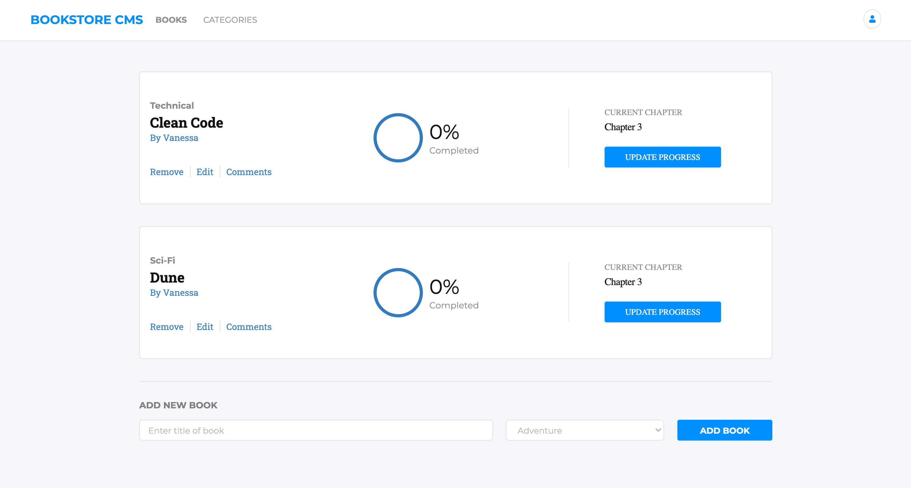

<p align="center">
  <a href="https://www.microverse.org/">
    
  </a>
  <a href="https://github.com/VanessaAoki/react-bookstore/blob/main/LICENSE">
    
  </a>
  <a href="https://github.com/VanessaAoki/react-bookstore">
    
  </a>
  <a href="https://github.com/VanessaAoki/react-bookstore">
    
  </a>
  <a href="https://github.com/VanessaAoki">
    
  </a>
</p>

# Bookstore
Bookstore is a website that allows users to display a list of books, add books to that list and delete the selected book.

<p align="center">
  
</p>

## Built With

- HTML, CSS, React & Redux;
- Visual Studio, Git & GitHub;

## Getting Started

### Running locally
To run this project, you only need a computer with a browser (like Google Chrome, Mozilla Firefox, Microsoft Edge, Apple Safari, etc.) installed, and follow these steps:

1. In your terminal, type the following, to clone this repository:

```sh
$ git clone https://github.com/VanessaAoki/react-bookstore.git
```

2. After, run the following commands in your terminal:

```sh
$ cd bookstore
$ yarn start
```
<details align="right">
<summary><small>What are these commands?</summary>
- the `$ cd` command is used to move to different folders. <br>
- while `$ yarn start` runs the app in the development mode.</small>
</details>

3. If your default browser do not start automatically, open it and type `http://localhost:3000` to run the application.

## Author

👩🏼‍💻 **Vanessa Aoki**

- GitHub: [@VanessaAoki](https://github.com/VanessaAoki)
- Twitter: [@VanessaSAoki](https://twitter.com/VanessaSAoki)
- Linkedin: [Vanessa Aoki](https://www.linkedin.com/in/vanessasaoki/)

## 🤝 Contributing

Contributions, issues, and feature requests are welcome!

Feel free to check the [issues page](https://github.com/VanessaAoki/react-bookstore/issues).

## Show your support

Give a ⭐️ if you like this project!

## 📝 License

This project is [MIT](./LICENSE) licensed.
